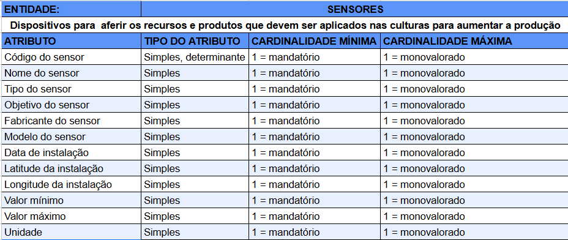
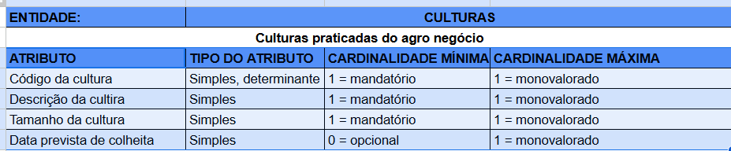
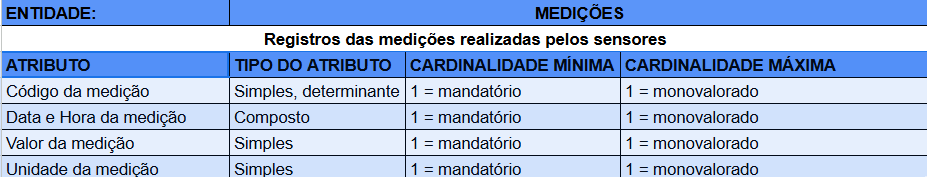
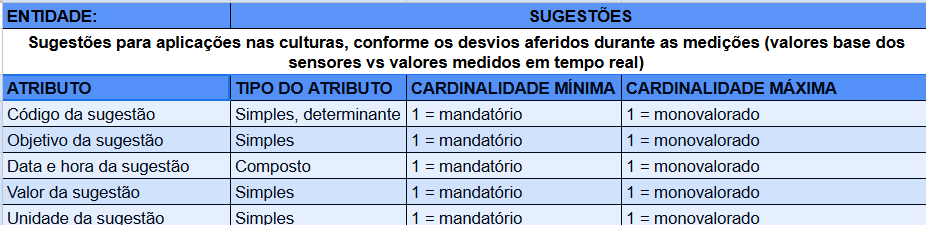
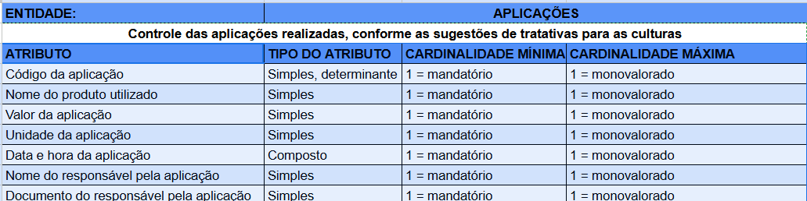
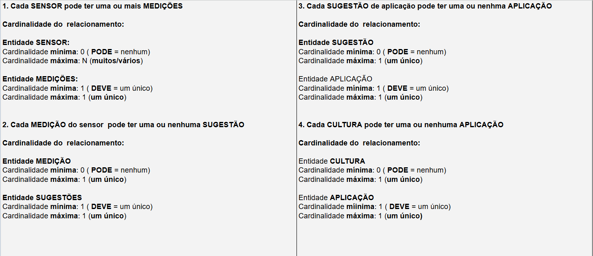

# Modelo de Banco de Dados para Monitoramento de Culturas

## 1. Introdução

Este projeto visa otimizar a produção agro por meio da modelagem de um banco de dados para o monitoramento de culturas. O modelo permite o armazenamento de dados de sensores de umidade, pH e nutrientes NPK (fósforo e potássio), permitindo a geração de recomendações para aplicações. O modelo fornece as informações detalhadas, gerando históricos e propostas de aplicações para maximizar a produção e minimizar o desperdício de recursos.

## 2. Objetivos

* **Coleta e Armazenamento de Dados:** Registrar de forma eficiente os dados dos sensores, incluindo valores, horários e localizações.
* **Geração de Recomendações:** Analisar os dados coletados para gerar recomendações personalizadas de aplicações de água e fertilizantes.
* **Controle de Aplicações:** Manter um registro detalhado de todas as aplicações realizadas, incluindo produtos, quantidades e datas.
* **Otimização da Produção:** Aumentar a produtividade do agro por meio do uso eficiente de recursos e da aplicação precisa de insumos.

## 3. Modelagem do Banco de Dados

O banco de dados é composto por cinco tabelas principais:

* **Sensores:**
    * Armazena informações sobre os sensores utilizados.
      
* **Culturas:**
    * Registra informações sobre as diferentes culturas cultivadas.
    
* **Medições:**
    * Armazena o histórico de medições dos sensores.
    
* **Sugestoes_Aplicacoes:**
    * Fornece as sugestões de aplicações geradas a partir das medições.
    
* **Aplicacoes_Realizadas:**
    * Registra as aplicações que foram executadas, a partir das Sugestões geradas.
    

## 4. Relacionamentos

## 5. Tecnologias Utilizadas

* **Modelagem:** Data Modeler Oracle
* **Linguagem de Modelagem:** MER/DER
* **Documentação:** Markdown

## 6. Implementação

O banco de dados será implementado utilizando Oracle. A interface de usuário para visualização e análise dos dados ainda não foi definida nessa etapa do projeto que visa entregar primeiramente o modelo de dados.

## 7. Benefícios

* Aumento da produção
* Otimização do uso dos insumos e recursos naturais.
* Tomada de decisões baseada em dados precisos.
* Histórico para análises futuras.
* Monitoramento em tempo real das condições das culturas.

## 8. Possibilidades Futuras

* Integração com sistemas de previsão climática.
* Implementação de inteligência artificial.
* Aplicativo móvel para acesso remoto aos dados.

## 9. Conclusão

Este projeto de modelagem de banco de dados representa um passo importante na otimização da produção agro. Ao fornecer aos produtores informações precisas e em tempo real, o modelo contribui para a produção sustentável e eficiente das culturas praticadas.
