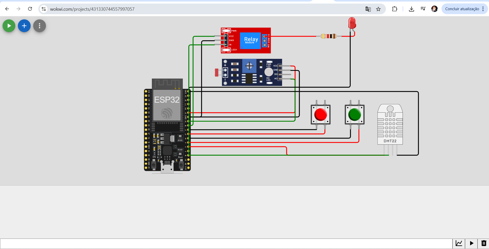

# Sistema de Irrigação Inteligente - FarmTech Solutions

Este projeto implementa um sistema de irrigação inteligente que utiliza sensores para monitorar as condições do solo e controlar automaticamente uma bomba de irrigação. O sistema é composto por duas partes principais:

1. **Sistema de Sensores e Controle com ESP32**: Implementado em C/C++, responsável pela leitura dos sensores e controle do relé da bomba de irrigação.
2. **Sistema de Armazenamento de Dados em Banco SQL**: Implementado em Python, responsável pelo armazenamento e análise dos dados coletados pelos sensores.

## Parte 1: Sistema de Sensores e Controle com ESP32

### Descrição do Circuito

O circuito foi construído na plataforma Wokwi utilizando os seguintes componentes:

- **ESP32**: Microcontrolador principal
- **Botão 1**: Simula o sensor de Fósforo (P)
- **Botão 2**: Simula o sensor de Potássio (K)
- **LDR (Light Dependent Resistor)**: Simula o sensor de pH
- **DHT22**: Simula o sensor de umidade do solo
- **Relé**: Controla a bomba de irrigação
- **LED embutido**: Indica visualmente o status da bomba

### Imagem do Circuito



### Lógica de Controle

O sistema implementa a seguinte lógica para controle da bomba de irrigação:

1. **Monitoramento contínuo**: Os sensores são lidos a cada 2 segundos.
2. **Controle baseado em umidade**: 
   - Se a umidade estiver abaixo de 30%, a bomba é ativada.
   - Se a umidade estiver acima de 70%, a bomba é desativada.
3. **Condições adicionais**:
   - Se o pH estiver fora da faixa ideal (muito ácido ou muito alcalino), a irrigação é evitada.
   - Se não houver nutrientes (fósforo e potássio) detectados, a irrigação é priorizada para melhorar a absorção de nutrientes que serão adicionados posteriormente.

### Funcionamento do Código

O código em C/C++ está estruturado da seguinte forma:

1. **Inicialização**: Configura os pinos, inicia a comunicação serial e o sensor DHT22.
2. **Loop principal**: Executa leituras periódicas dos sensores e toma decisões de controle.
3. **Funções específicas**:
   - `lerSensores()`: Realiza a leitura de todos os sensores.
   - `analisarDadosEControlarBomba()`: Implementa a lógica de controle da bomba.
   - `exibirDados()`: Formata e exibe os dados no monitor serial para posterior armazenamento.

Os dados são enviados pelo monitor serial em formato CSV para facilitar a importação para o banco de dados:
```
timestamp,fosforo,potassio,ph,umidade,bomba_status
```
