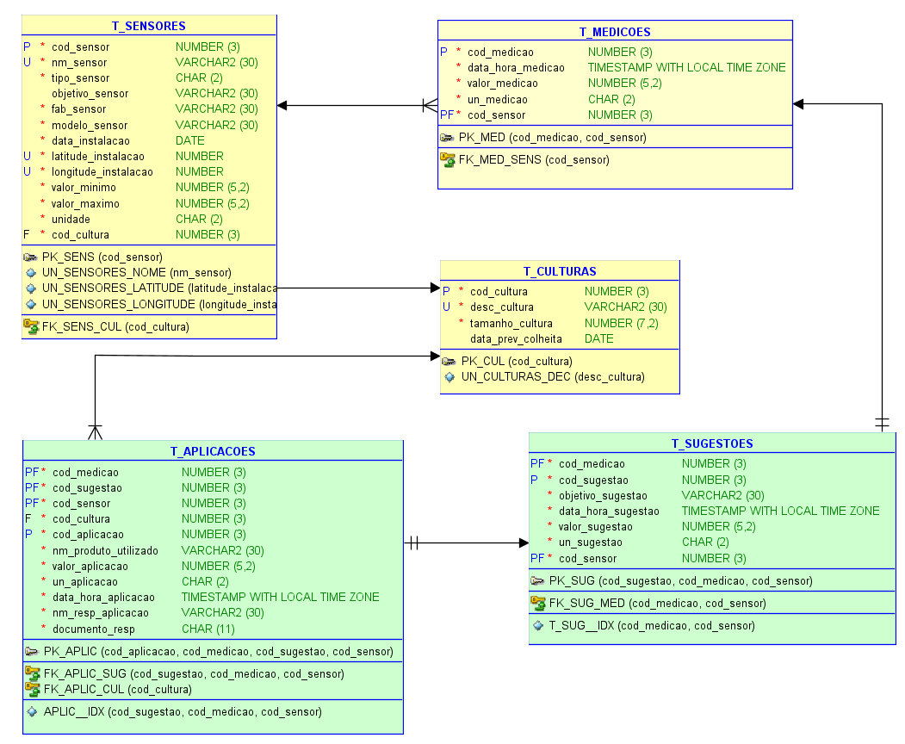

# Sistema de Coleta de Dados de Sensores Agrícolas

Este projeto implementa um sistema de coleta de dados de sensores agrícolas que simula o armazenamento e manipulação de informações sobre culturas, sensores, medições, sugestões e aplicações em um banco de dados Oracle

## Estrutura do Projeto

O projeto está organizado da seguinte forma:

```
Entrega-2/
├── csv_data/                  # Arquivos CSV com dados de exemplo
│   ├── t_culturas.csv         # Dados de culturas agrícolas
│   ├── t_sensores.csv         # Dados de sensores
│   ├── t_medicoes.csv         # Dados de medições
│   ├── t_sugestoes.csv        # Dados de sugestões
│   └── t_aplicacoes.csv       # Dados de aplicações
├── Fase3_Cap1_Ent2_CRUD.py    # Classe principal para gerenciamento do banco de dados
└── README.md                  # Este arquivo
```

## Modelo Relacional

O sistema é baseado no seguinte modelo relacional:



O modelo consiste em cinco tabelas principais:

1. **T_CULTURAS**: Armazena informações sobre as culturas agrícolas.
2. **T_SENSORES**: Registra os sensores instalados e suas características.
3. **T_MEDICOES**: Contém as medições realizadas pelos sensores.
4. **T_SUGESTOES**: Armazena sugestões baseadas nas medições.
5. **T_APLICACOES**: Registra as aplicações realizadas com base nas sugestões.

## Relação com o MER da Fase 2

O banco de dados implementado segue fielmente o Modelo Entidade-Relacionamento (MER) desenvolvido na Fase 2 do projeto. As principais correspondências são:

### Entidades e Tabelas

Cada entidade do MER foi mapeada para uma tabela correspondente no banco de dados:

- A entidade **Cultura** é representada pela tabela `T_CULTURAS`
- A entidade **Sensor** é representada pela tabela `T_SENSORES`
- A entidade **Medição** é representada pela tabela `T_MEDICOES`
- A entidade **Sugestão** é representada pela tabela `T_SUGESTOES`
- A entidade **Aplicação** é representada pela tabela `T_APLICACOES`

### Relacionamentos

Os relacionamentos do MER foram implementados através de chaves estrangeiras:

- Um sensor pertence a uma cultura: `T_SENSORES.cod_cultura` referencia `T_CULTURAS.cod_cultura`
- Uma medição é realizada por um sensor: `T_MEDICOES.cod_sensor` referencia `T_SENSORES.cod_sensor`
- Uma sugestão é baseada em uma medição: `T_SUGESTOES.cod_medicao` e `T_SUGESTOES.cod_sensor` referenciam `T_MEDICOES.cod_medicao` e `T_MEDICOES.cod_sensor`
- Uma aplicação é baseada em uma sugestão: `T_APLICACOES.cod_sugestao`, `T_APLICACOES.cod_medicao` e `T_APLICACOES.cod_sensor` referenciam `T_SUGESTOES.cod_sugestao`, `T_SUGESTOES.cod_medicao` e `T_SUGESTOES.cod_sensor`
- Uma aplicação é realizada em uma cultura: `T_APLICACOES.cod_cultura` referencia `T_CULTURAS.cod_cultura`

Para uma análise mais detalhada da relação entre o MER e a implementação, consulte os arquivos da Fase 2.

## Arquivos CSV de Exemplo

Os arquivos CSV contêm dados de exemplo para cada tabela do modelo relacional:

### t_culturas.csv

Contém informações sobre diferentes culturas agrícolas, como soja, milho e café, incluindo tamanho e data prevista de colheita.

### t_sensores.csv

Contém dados de sensores instalados, incluindo tipo (umidade, pH, temperatura), fabricante, modelo e localização.

### t_medicoes.csv

Registra medições realizadas pelos sensores, com data/hora, valor e unidade de medida.

### t_sugestoes.csv

Contém sugestões baseadas nas medições, como irrigação ou aplicação de fertilizantes.

### t_aplicacoes.csv

Registra aplicações realizadas com base nas sugestões, incluindo produto utilizado, quantidade e responsável.

## Operações CRUD Implementadas

O sistema implementa operações CRUD (Create, Read, Update, Delete) para todas as tabelas do modelo relacional:

### Create (Criar)

Métodos para inserir novos registros em cada tabela:

- `create_cultura()`: Insere uma nova cultura
- `create_sensor()`: Insere um novo sensor
- `create_medicao()`: Insere uma nova medição
- `create_sugestao()`: Insere uma nova sugestão
- `create_aplicacao()`: Insere uma nova aplicação

### Read (Ler)

Métodos para recuperar dados das tabelas:

- `read_cultura()`: Recupera dados de culturas
- `read_sensor()`: Recupera dados de sensores
- `read_medicao()`: Recupera dados de medições
- `read_sugestao()`: Recupera dados de sugestões
- `read_aplicacao()`: Recupera dados de aplicações

### Update (Atualizar)

Métodos para atualizar registros existentes:

- `update_cultura()`: Atualiza dados de uma cultura
- `update_sensor()`: Atualiza dados de um sensor
- `update_medicao()`: Atualiza dados de uma medição
- `update_sugestao()`: Atualiza dados de uma sugestão
- `update_aplicacao()`: Atualiza dados de uma aplicação

### Delete (Excluir)

Métodos para remover registros:

- `delete_cultura()`: Remove uma cultura
- `delete_sensor()`: Remove um sensor
- `delete_medicao()`: Remove uma medição
- `delete_sugestao()`: Remove uma sugestão
- `delete_aplicacao()`: Remove uma aplicação

Todas as operações CRUD implementam verificações de integridade referencial para garantir a consistência dos dados.

## Consultas Analíticas

Além das operações CRUD básicas, o sistema implementa consultas analíticas para obter insights dos dados:

- `get_medicoes_by_cultura()`: Recupera medições associadas a uma cultura específica
- `get_aplicacoes_by_cultura()`: Recupera aplicações associadas a uma cultura específica
- `get_sugestoes_by_sensor()`: Recupera sugestões associadas a um sensor específico

## Como Usar o Sistema

### Pré-requisitos

- Python 3.6 ou superior
- Oracle

### Configuração

1. Clone o repositório ou extraia os arquivos para uma pasta local
2. Certifique-se de que o script Oracle e os arquivos CSV estão nos locais corretos

### Execução

1. Execute o script Python principal:

```bash
Fase3_Cap1_Ent2_CRUD.py
```
2. Execute o script de criação da tabelas no banco de dados Oracle

SCRIPT_DDL_PROJETO_FASE2_CAP1.sql

3. O script irá:
   - Conectar no banco de dados
   - Importar os dados dos arquivos CSV
   - Demonstrar operações CRUD básicas
   - Executar consultas analíticas de exemplo

## Justificativa da Estrutura de Dados

Para este projeto, optamos por uma estrutura de dados relacional implementada em Oracle, que oferece um equilíbrio ideal entre robustez, desempenho e fidelidade ao modelo entidade-relacionamento (MER) original. A escolha do Oracle como sistema de gerenciamento de banco de dados se justifica pelos seguintes fatores:

1. **Robustez**: O Oracle é um SGBD de nível empresarial, capaz de lidar com grandes volumes de dados e operações complexas.
2. **Confiabilidade**: Oferece recursos avançados de recuperação e alta disponibilidade, essenciais para dados críticos agrícolas.
3. **Segurança**: Fornece mecanismos robustos de controle de acesso e proteção de dados.
4. **Suporte completo a linguagem Transact-SQL**: Permite implementar todas as operações CRUD e consultas complexas necessárias.
5. **Integridade referencial**: Suporta chaves estrangeiras e restrições de integridade, essenciais para manter a consistência do modelo relacional.
6. **Funções avançadas de data/hora**: Oferece funções como TO_DATE e TO_TIMESTAMP que facilitam o trabalho com dados temporais, importantes para registros de medições e aplicações.
   
## Conclusão

Este sistema demonstra a implementação de um banco de dados relacional para a coleta de dados de sensores agrícolas, seguindo fielmente o modelo entidade-relacionamento definido na Fase 2 do projeto. A implementação em Python, fornece uma interface clara e consistente para manipulação dos dados, permitindo operações CRUD completas e consultas analíticas.
